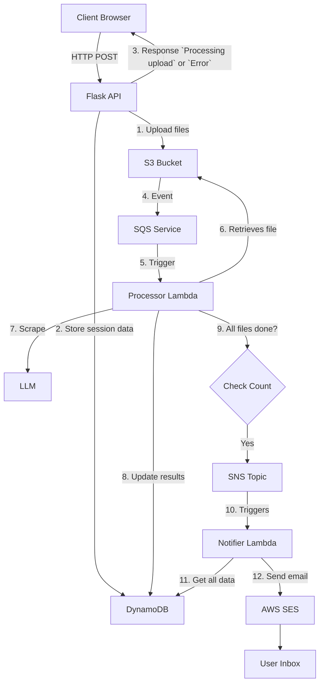

# DocDigest

DocDigest is a small webapp tool created for users to upload a document (pdf, doc, docx, txt) and the contents will be processed by an LLM to return a summary of the document.

## Features

- User uploads documents via a GUI on the web app
- The documents are processed via an LLM to provide a summary of the contents of the document
- The user is either notified via email of the completion with a zip containing the contents of the summaries
- The user can view in realtime the processing of the documents

## Architecture
ADRs in `/documentation`


## Quick Start

### Prerequisites

- AWS account with appropriate permissions
- Python 3.11+
- Docker

### Local Development
Clone the repo
```bash
git clone https://github.com/TheBigBookMan/DocDigest.git
cd docdigest
```

### Environment Setup
Setup the virtual environment
```bash
python3.11 -m venv venv
source venv/bin/activate
```

### Installation
Install correct dependencies
```bash
pip install -r requirements.txt
```

### Configuration
Setup the environment variables
```bash
cp .env.example .env
cp .flaskenv.example .flaskenv
```

.env
```
ENVIRONMENT='development'

AWS_ACCESS_KEY_ID=access_key_id_for_iam
AWS_SECRET_ACCESS_KEY=secret_secret_key
AWS_REGION=aws_region
S3_BUCKET=bucket_name
```

.flaskenv
```
FLASK_APP=app/app.py // points flask to look for where app starts
FLASK_DEBUG=1 // this turns on debug mode for hot reloading in flask
```

### Start
Start the flask app locally at `http://127.0.0.1:5000`
```bash
flask run
```

### Usage

# Basic example
command --flag input.file

# Another example
command --other-flag

## Development

### Running Tests

How to run the test suite.

### Local Development

How to run locally without deploying to AWS.

## Deployment

How to deploy to AWS (ideally one command).

## Cost Estimation

What this costs to run at various scales.

## License

MIT or whatever you choose.